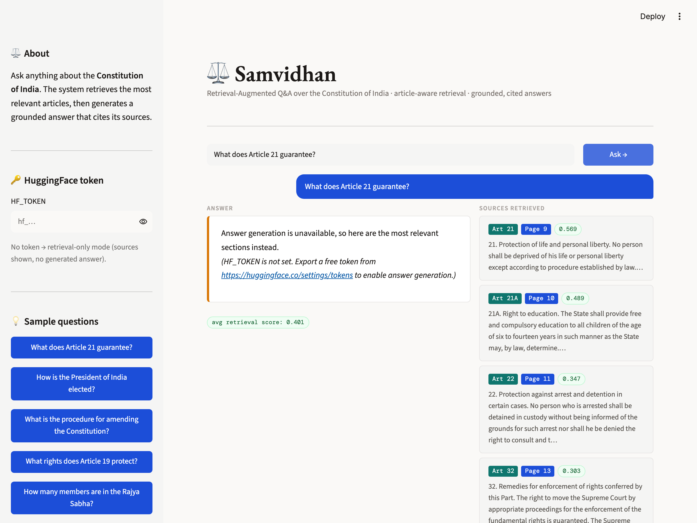

<div align="center">

# ⚖️ Samvidhan

**Article-aware Retrieval-Augmented Q&A over the Constitution of India**

Ask a question in plain English → get a grounded answer that cites the exact articles it came from.

[](https://github.com/vatsal057/samvidhan/actions/workflows/ci.yml)
[](https://www.python.org/)
[](LICENSE)
[](https://github.com/astral-sh/ruff)

</div>

---

## Overview

*Samvidhan* (संविधान — "constitution") answers natural-language questions about the
Constitution of India. It retrieves the most relevant articles from a vector store,
then asks an LLM to write a grounded answer **using only those articles** — and shows
you the sources it used, with article and page citations, so every answer is auditable.

The Constitution is an ideal corpus: it's public domain, highly structured (395+
articles), and genuinely hard to recall. The interesting engineering here isn't the
happy path — it's **measuring where retrieval fails and fixing it**. That analysis lives
in [FAILURES.md](FAILURES.md), and the fixes it recommended are now shipped features.

> **Runs offline out of the box.** A small public-domain sample of the Constitution is
> bundled, so `make ingest && make run` works with zero external accounts. Add an
> `HF_TOKEN` to enable full answer generation; without one, the app degrades gracefully
> to retrieval-only and still shows the matching articles.

---

## Features

- **Article-aware chunking** — splits the document at article boundaries instead of
  fixed character windows, so a chunk is a coherent legal unit. This was the #1 fix
  identified in the failure analysis.
- **Grounded generation with a hallucination guard** — the model may only use retrieved
  context and must emit a fixed refusal string when the answer isn't present.
- **Optional cross-encoder re-ranking** — over-fetch by embedding similarity, then
  re-order with a cross-encoder (`USE_RERANKER=true`) for higher precision.
- **Cited sources** — every answer lists the articles, pages, and similarity scores it
  relied on.
- **Retrieval-only fallback** — no token, cold model, or network blip never yields a
  blank screen; the relevant articles are always shown.
- **Evaluation harness** — a labelled question set + metrics (Hit@k, mean recall, MRR)
  so retrieval quality is a number, not a vibe.

---

## Screenshots



Every answer is accompanied by the exact articles it was built from — here in
retrieval-only mode (no token), where the app still surfaces Article 21 and its
neighbours with page numbers and similarity scores. Add an `HF_TOKEN` and the answer
box fills with a grounded, generated summary of those same sources.

---

## How it works

```
                    ┌─────────────────────────────┐
  User question ──► │  all-MiniLM-L6-v2 embedder  │──► 384-d query vector
                    └─────────────────────────────┘
                                   │
                                   ▼
                    ┌─────────────────────────────┐
                    │  ChromaDB (cosine, fetch_k) │──► candidate chunks
                    └─────────────────────────────┘
                                   │
                    (optional) cross-encoder re-rank → top_k
                                   │
                                   ▼
                    ┌─────────────────────────────┐
                    │  Strict grounded prompt      │
                    │  → Mistral-7B (HF Inference) │──► cited answer
                    └─────────────────────────────┘
```

No LangChain. The retrieval, chunking, and prompt logic are written directly — a few
hundred readable lines that are easy to test and debug.

---

## Quick start

```bash
git clone https://github.com/vatsal057/samvidhan.git
cd samvidhan

python -m venv .venv && source .venv/bin/activate
make install                 # or: pip install -r requirements-dev.txt

make ingest                  # build the vector store from the bundled sample
make run                     # launch Streamlit at http://localhost:8501
```

Enable grounded answers by exporting a free HuggingFace token:

```bash
cp .env.example .env         # then edit .env, or:
export HF_TOKEN=hf_xxxxxxxxxxxx
```

### Use the full Constitution instead of the sample

```bash
./scripts/download_constitution.sh        # fetches the official public-domain PDF
python -m samvidhan.ingest --pdf constitution_of_india.pdf
```

### Docker

```bash
make docker                  # builds, ingests the sample, serves on :8501
```

---

## Usage

**In the app:** type a question (or click a sample), read the answer, and inspect the
sources panel for the articles and pages it cited.

**Programmatically:**

```python
import sys; sys.path.insert(0, "src")
from samvidhan.pipeline import answer

result = answer("What does Article 21 guarantee?")
print(result.answer)                 # grounded, cited answer
for s in result.sources:
    print(s.article, s.page, round(s.score, 3))
```

**Evaluate retrieval quality:**

```bash
make eval                              # reranker off
USE_RERANKER=true python eval/run_eval.py   # compare with re-ranking on
```

---

## Architecture

```
samvidhan/
├── app.py                     # Streamlit UI (thin; imports the package)
├── src/samvidhan/
│   ├── config.py              # env-driven settings (frozen dataclass)
│   ├── chunking.py            # article-aware chunker + windowed fallback
│   ├── ingest.py              # PDF/text → chunks → ChromaDB
│   ├── retrieve.py            # embed → search → optional re-rank
│   ├── generate.py            # grounded prompt + HF Inference client
│   └── pipeline.py            # answer() = retrieve → generate → RAGResult
├── eval/                      # labelled questions + retrieval metrics
├── tests/                     # unit tests (pure logic, no ML stack needed)
├── data/sample/               # bundled public-domain corpus for offline demo
├── Dockerfile · Makefile · pyproject.toml
└── .github/workflows/ci.yml   # lint → tests → ingest → eval
```

**Design choices**

- *Lazy heavy imports.* `sentence-transformers`/`chromadb` load only inside the loader
  functions, so unit tests run in milliseconds without the ML stack.
- *Separation of concerns.* Retrieval, generation, and orchestration are independent and
  independently testable; the UI holds no business logic.
- *Fail soft.* Generation is best-effort; the pipeline always returns useful sources.

---

## Tech stack

| Component | Choice | Why |
| --- | --- | --- |
| Embeddings | `all-MiniLM-L6-v2` (local) | Fast, free, no API needed for retrieval |
| Vector store | ChromaDB (persistent) | Simple, local, cosine ANN built in |
| Re-ranker | `ms-marco-MiniLM-L-6-v2` cross-encoder | Precision boost, optional |
| Generation | Mistral-7B-Instruct via HF Inference API | Strong open model, no self-hosting |
| PDF parsing | pypdf | Lightweight, pure-Python |
| UI | Streamlit | Minimal code, deployable to HF Spaces |
| Quality | pytest · ruff · GitHub Actions | Tested, linted, CI-verified |

---

## Roadmap

- [x] Article-aware chunking (was FAILURES.md item #1)
- [x] Optional cross-encoder re-ranking (was item #2)
- [x] Retrieval evaluation harness with Hit@k / MRR
- [ ] Query expansion for vague questions ("PM powers" → sub-queries)
- [ ] Faithfulness check: a second LLM pass verifying the answer against context
- [ ] Streaming responses in the UI
- [ ] Support for amendments and case-law cross-references

---

## License

[MIT](LICENSE). The Constitution of India is in the public domain.
